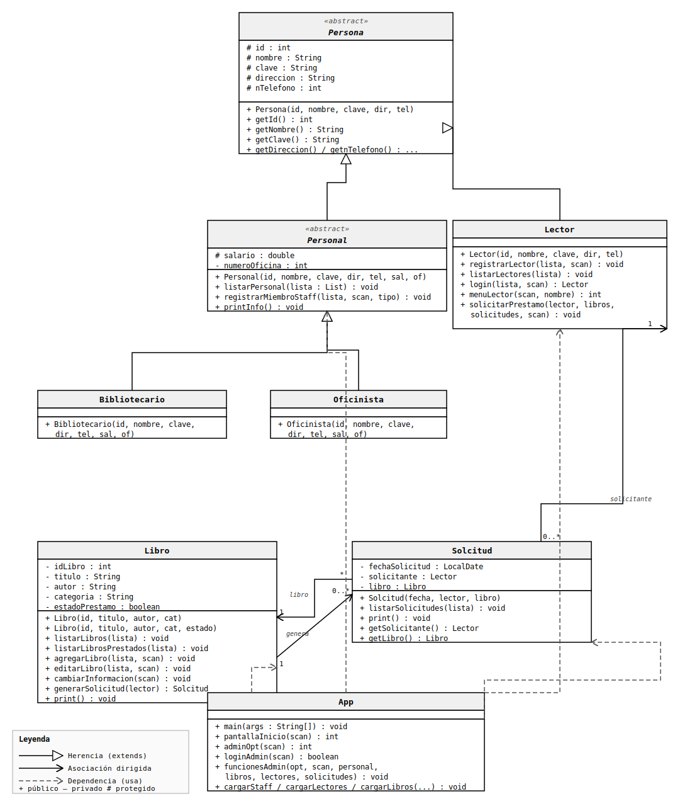

# sistema de gestión de bibliotecas

este proyecto es una aplicación de consola en java diseñada para la gestión integral de una biblioteca. aplica principios avanzados de **programación orientada a objetos (poo)** como herencia, encapsulamiento y polimorfismo para modelar de forma óptima las interacciones entre los diferentes tipos de usuarios (administradores, oficinistas, bibliotecarios y lectores). Como usuario administrador implementamos el control de inventario de libros y solicitudes de préstamo.

## Características principales

- **estructura de menús navegables:** Sistema de portales segmentados mediante consolas interactivas (portal de inicio, portal de administrador y portal de lector).
- **gestión automatizada de personal:** Creación unificada de personal administrativo (`oficinista` y `bibliotecario`) heredando atributos de una infraestructura común para evitar redundancia de código.
- **control de inventario y préstamos:** monitoreo del estado de los libros (disponibles o prestados) y rastreo de solicitudes mediante instancias de la clase `solicitud`.
- **persistencia en memoria:** datos semilla precargados para pruebas de flujo inmediatas (validación de ID's únicos, listados filtrados, etc.).

---

## Arquitectura del sistema (diagrama de clases)

El diseño del software sigue una jerarquía estricta basada en POO. A continuación, se detalla el modelado de las entidades mediante el diagrama de clases del proyecto:



### Análisis de la estructura

- **jerarquía de usuarios:** la clase abstracta `persona` encapsula los datos de identidad base. de ella hereda de forma directa `lector` y la clase abstracta `personal` (la cual centraliza atributos laborales como el salario y el número de ubicación física de las oficinas asignadas para proveer polimorfismo a `oficinista` y `bibliotecario`).
- **Relaciones de dependencia y asociación:** la clase principal `app` actúa como la controladora del sistema, gestionando las colecciones de datos e interactuando con las clases del núcleo del problema. (`libro` y `solicitud`).

---

## 📁 Estructura del proyecto

el código está organizado siguiendo las convenciones de paquetes estándar de un proyecto gestionado por maven:

```text
├── docs
│   └── diagrama_clases_biblioteca.svg  # diagrama de arquitectura del sistema
├── pom.xml                             # archivo de configuración de maven
├── readme.md                           # documentación principal del proyecto
└── src
    └── main
        └── java
            └── com
                └── biblioteca
                    ├── app.java         # clase principal (controlador y menús)
                    ├── core
                    │   ├── libro.java   # modelo de datos y utilidades de libros
                    │   └── solcitud.java# gestión de registros de préstamos
                    └── users
                        ├── bibliotecario.java
                        ├── lector.java
                        ├── oficinista.java
                        ├── persona.java  # superclase base (abstracta)
                        └── personal.java # clase intermedia de staff (abstracta)
```